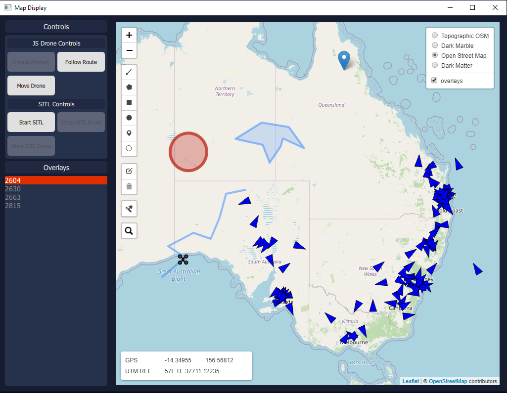
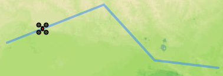
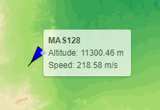

# Introduction 

This project is a demonstration showcasing the packaging of the Javascript mapping framework [Leaflet](https://leafletjs.com/) into a QML/Qt application.



I've also got a C++ implementation here: https://github.com/rhysbartholomaeus/leafletQt_CPP


## Requirements

* Built on Qt 5.12.9 MSVC 2017 64 Bit
* Java 8 or 11 JRE - Optional
* [GeoServer](http://geoserver.org/) (Tested with version 2.17.2) - Optional - Requires Java
* Python (Tested on 3.8.5) - Optional
* Python Flask & Flask CORS - Optional

## Build 

Open the .PRO file in Qt Creator and build and run the project as per usual for Qt applications. 

**Note:** Disable Shadow Building in the project settings.

## Usage

Start the application in Qt Creator. The default map will load using the internet-provided OpenStreetMaps tile server.

As part of mapping verification, the map has also been coded to accept a WMS service offered by a local instance of GeoServer. Refer to the **GeoServer Setup** section for advice. 

To create an overlay, select an appropriate shape on the left hand side tool bar and draw on the map. The unique Leaflet ID for the shape will appear in the 'Overlays' column on the left of the application. 

To delete a shape, select the trashcan icon and select the desired shape(s) for deletion. Once finished, click the _Save_ button to delete the overlay for good.

### Optional - GeoServer WMS

 Start GeoServer with a WMS service loaded. This provides an alternative map layer for viewing in the application.

### Optional - Flask OpenSky Network

Start flask in the source directory containing `app.py` using the following command:
```
flask run --port 5002
```
This provides real-world ADS-B traffic from the free-to-use OpenSky Network system. Free users can query once every 10 seconds for a live aircraft traffic update. 

You might be wondering why it is necessary to run a Python server to obtain the data? The leaflet.realtime library that facilitates live data overlays on the leaflet map layer expects GeoJSON-formatted data. Unfortunately, by default, the OpenSky Networks does not provide the output data in the expected format. 

While possible to deal with this data conversion using Javascript locally, it requires implementing your own `async` functionality. Not that this is a hard process, it's just a lot easier to run the data through a secondary service that outputs the format the leaflet.realtime library expects. (Since leaflet.realtime already implements its own `async` functionality)

## GeoServer Setup

Leaflet was trialled with GeoServer to confirm that the framework can function with standard mapping formats. For the purposes of this demonstration, the system uses a cascading WMS service, reducing the need for the user to download gigabytes of map tile data.

The following steps were taken to establish a WMS service for Leaflet to consume:
1. Download GeoServer from http://geoserver.org/
2. Ensure that Java bin directory is on the system PATH
    * Run `java --version` from the command line to confirm
3. From the GeoServer bin directory, run `startup.bat`
4. Using a webbrowser, navigate to `http://localhost:8080/geoserver/web/`
    * Sign in using username: 
        ```
        admin
        ```  
    * and password: 
        ```
        geoserver
        ```
5. [Follow these instructions for adding a WMS service](https://docs.geoserver.org/stable/en/user/data/cascaded/wms.html)
    * Cascading WMS services use a remote hosted service instead of requiring the user to download gigabytes of data. One such example is the WMS service offered for free from: http://ows.mundialis.de
6. Below is a quick overview for setting up a cascading WMS service:
    * In GeoServer, select the Workspaces -> Add new workspace
    * Set the name and a URI (The URI will be used in the URL for the WMS service).
    * In the Edit Workspace page, tick the Enabled checkbox.
    * Click Stores -> Add new store. In the 'New data source' page, select the WMS option under 'Other Data Sources'
    * Select the appropriate workspace and provide a WMS Source Name
    * In the capabilities URL, paste in the URL from your WMS service, ie: `http://ows.mundialis.de/services/service?` for the Mundialis topographic WMS service. 
    * Click Save.
    * The next page displays the available WMS services offered from the capabilities URL. Select the desired service and click 'Publish'
    * On the next page, scroll to the bottom and click 'Save' (By default the data will be enabled for use.)
    * Test the service by clicking Layer Preview -> OpenLayers (Under 'Common Formats')
6. In your HTML page or similar, use the following Javascript snippet to create a map using the MS service:
    ```
    var mymap = L.map('mapid').setView([0, 0], 5);

    var wmsLayer = L.tileLayer.wms('http://localhost:8080/geoserver/map_server/wms?', {
        layers: 'TOPO-WMS'
    }).addTo(map);

    L.control.layers({
            "wmsLayer": wmsLayer.addTo(map),
        }).addTo(map);
    ```
    This creates a tilelayer pointed to your local instance of the WMS service. **Note**: This assumes that you have imported the necessary Javascript / CSS files. For more details, refer to [Leaflet getting started guide.](https://leafletjs.com/examples/quick-start/)

### Ok that's cool, what if you want to use something like GeoTIFF?

1. Obtain a GeoTIF source, for example: https://earthobservatory.nasa.gov/features/NightLights/page3.php
2. Create a directory in the GeoServer data_dir directory, IE: `geoserver/data_dir/data/YOURDATA` and place the file(s) in there.
3. Start and open GeoServer.
4. Click Stores -> Add new Store
5. Provide a Data Source Name and link the file under the Connection Parameters.
6. On the New Layer page, click Publish
7. Check the coordinate reference system is consitent with the captured imagery (IE: EPSG 4326)
8. Open the Publishing tab. Verify under Root Layer Capabilities that WMS Global Settings are selected.
9. Click Save
10. Update your map to include the WMS layer using your GeoTIFF raster image, IE:

```
    var darkmarble = L.tileLayer.wms('http://localhost:8080/geoserver/map_server/wms?', {
        layers: 'BlackMarble_2016_D2_geo'
    }).addTo(map);
```
Don't forget to add a control as well:
```
    L.control.layers({
            "wmsLayer": wmsLayer.addTo(map),
            "osmLayer": osm.addTo(map),
            "darkmarble": darkmarble.addTo(map)
        }).addTo(map);
```

## Connecting QML to Javascript

Communication between the Javascript running on the HTML page and the host QML application can be achieved via the following.

In QML, create a Qt object or similar:

```
QtObject{
    id: pageChannel
    WebChannel.id: "qmlLeaflet"

    property string systemId: "QML334524"

    signal logString(string message)

    function someMethod(idValue){
        // Do something
    }
}

WebEngineView {
    url: "qrc:/index.html"
    webChannel: channel
}

WebChannel {
    id: channel
    registeredObjects: [pageChannel]
}
```
This creates a QtObject that can be accessed via Javascript running on the HTML page. 

On the HTML page, create the script following:
```
<script type="text/javascript" src="qrc:///qtwebchannel/qwebchannel.js"></script>

<script>
    var qmlLeaflet;

    window.onload = function()
    {
        // Set up the QWebChannel for bi-directional comms with the host QML application.
        new QWebChannel(qt.webChannelTransport, function(channel) {
            qmlLeaflet = channel.objects.qmlLeaflet;

            // connect to a signal
            qmlLeaflet.logString.connect(function(someText) {
                console.log("Got signal: " + someText);
            });
        });
    }
    
    // Demonstration for getting/setting remote QtObject properties
    function getPropertyValue()
    {
        var value = qmlLeaflet.systemId;

        console.log(qmlLeaflet.systemId);
        qmlLeaflet.systemId = "RTX3090";
        console.log(qmlLeaflet.systemId);

        qmlLeaflet.systemId = value;
    }
</script>
```
All calls are done a synchronously through the WebChannel module.

## Connecting C++ to Javascript

Similar to QML, connection through C++ is as simple as:

1. Create an object to use as the medium:
    * jsobj.h:
```
#ifndef JSOBJ_H
#define JSOBJ_H

#include <QObject>
#include <QDebug>

class jsobj : public QObject
{
    Q_OBJECT
public:
    jsobj();

public slots:
    Q_INVOKABLE void log(const QString &str);
    Q_INVOKABLE void shapeAdded(const QString &str);

signals:
    Q_INVOKABLE void routeAdded(const QString &routeId);

};

#endif // JSOBJ_H

```
    * jsobj.cpp:
```

#include "include/jsobj.h"

jsobj::jsobj()
{

}

void jsobj::log(const QString &str){
    qDebug() << "GOT STR: " << str ;
}

void jsobj::shapeAdded(const QString &str){
    qDebug() << "Got shape ID: " << str;
    emit jsobj::routeAdded(str);
}

```
Then in your primary Qt application class:
```
// Warning - Demonstration - Not all code present.
MainWindow::MainWindow(QWidget *parent)
    : QMainWindow(parent)
    , ui(new Ui::MainWindow)
{
    ui->setupUi(this);

    m_view = new QWebEngineView(ui->mapDisplay);

    QWebChannel *channel = new QWebChannel();
    jsobj *js = new jsobj();
    m_view->page()->setWebChannel(channel);
    channel->registerObject(QString("JsInterface"), js);

    m_view->page()->load(QUrl("file:///./html/index.html"));

    connect(m_view, &QWebEngineView::loadFinished, this, &MainWindow::handleOnLoad);
    connect(ui->clearAllTracks, SIGNAL (released()), this, SLOT (handleClearAllTracks()));
    connect(ui->trackQueryInit, SIGNAL (released()), this, SLOT (handleStartTrackQuery()));
    connect(js, &jsobj::routeAdded, this, &MainWindow::updateList);
    connect(ui->spawnPlane, SIGNAL (released()), this, SLOT (handleSpawnPlane()));
}
// Warning - Demonstration - Not all code present.
```
To run Javascript from the WebEngine, use the WebEngineView object (`m_view` in this instance):
```
// Warning - Demonstration - Not all code present.
void MainWindow::handleStartTrackQuery(){
    qDebug() << "Commencing track query.";
    m_view->page()->runJavaScript("initiateTrackQuery(trackLayer);");
}
// Warning - Demonstration - Not all code present.
```
Invoking C++ from Javascript is identical to that in QML:
```
new QWebChannel(qt.webChannelTransport,
function(channel){
    var webobj = channel.objects.JsInterface;
    webobj.shapeAdded('Message');
    
});
```

## Leaflet modules in use

To faclitate several different functions, the following Leaflet addon modules were used:
* Leaflet Draw
* Leaflet Realtime
* Leaflet Moving Marker
* Leaflet Track Symbol

### Leaflet Draw

Leaflet Draw provides the ability to add overlays to the map, using a separate feature layer that is superimposed over the map. 

Each overlay (Polygon, line, square, circle, marker) has a unique leaflet ID associated with it (In the form of a varying digit number. Complicated shapes typically have larger ID values than simple markers or lines). It would be trivial to store the overlay IDs inside a map, with the ID acting as a key and other attributes present inside. This would allow for overlay names and other metadata to be assigned to the shape with relative ease. Retreiving the overlay ID is conducted through the JS WebChannel, allowing bi-drectional communication between the QML (Or C++) application. In this instace, the IDs are stored in a singleton QML ListModel. 

Overlays are not persistent nor are they shared, so this mechanism would need to be introduced in the future if this functionality were desired. 

### Leaflet Realtime

Leaflet Realtime provides a means of drawing GeoJSON data on the map at a set, fixed rate. The data retrieval is not 'realtime', in that it relies on asynchronous fetch (GET requests) to obtain the data. 
A consequence of this is that the Realtime addon is reliant on GeoJSON data, requiring items to be converted first before being displayed. This was the case with the OpenSky Network Python server, which provides GeoJSON datatypes for ADS-B traffic. 

Leaflet realtime typically takes in a URL for requests, however the Realtime addon can also use a function in place of a URL, IE:

```
L.realtime({
        function(success, error){
            var flightData = httpGet('https://opensky-network.org/api/states/all').then(function(result){return result});
            success(flightData);
    }
```
In this example, `httpGet` was a test function which queried the URL, performed the necessary JSON to GeoJSON conversion of the data and returned the response. The realtime `success` function then takes in the data and projects this onto the map for each of the feature objects present in the GeoJSON feature set. 

The function is expected to return straight away, so if performing a fetch, it is necessary to write you're own asynchronous logic to handle the delayed promise return. As such, it was just as simple to use a Python server to handle this. 

### Leaflet Moving Marker
 
Ever wanted to move a maker around the screen? This addon lets you do it. This allows you to send multiple points to an existing marker and make it follow each point. For the purposes of demonstration, the points are pulled from a route created using the Leaflet Draw addon. 

Unfortuantely, this addon creates a moving marker using a timer for the entire journey or for each leg of the trip. This means that markers that are spawned to follow a route are moving based on time allocated for the journey/leg, rather than a speed. Additionally, markers will snap to the first point, rather than transition to them. 

Note that the Moving Marker library only supports Polylines. Other polygons (squares, rectangles, circles, etc) are not supported due to differences in how the point data is stored for those shapes. 

Below is a custom icon attached to a moving marker, following the designated route:



#### Using a controllable data soruce - ArduPilot

I also trialled attaching an Ardupilot Software in the Loop simulated drone and the Python DroneKit library to the Leaflet marker display. This was a separate flask server that allows a user to spin up a Ardupilot drone and retrieve it's position. Commands were going to be added to allow the user to manually direct the drone around the map (using the go-to-location MAVProxy commands), however this has not been fully implemented at this stage. 

### Leaflet Track Marker

This addon provides the ability to replace the standard marker icon with a marker that showcases the heading and speed of the data in question.

Tool-tip bindings can be added to showcase specific details for a track. Note that each layer is automatically updated when data changes, reducing the overhead required for the implementing programmer. 



Binding the tooltip to the track data:

```
    pointToLayer: function(feature, latlng) {
        // style the aeroplane loction markers with L.DivIcons
        var marker = L.trackSymbol(latlng, {
        trackId: feature.id,
        fill: true,
        fillColor: '#0000ff',
        fillOpacity: 1.0,
        stroke: true,
        color: '#000000',
        opacity: 1.0,
        weight: 1.0,
        speed: feature.properties['velocity'],
        course: feature.properties['true_track'],
        heading: feature.properties['true_track']
    }).bindTooltip(
            '<b>'+ feature.properties['callsign'] 
                +'</b><br>Altitude: '+ feature.properties['geo_altitude'] +' m <br>' 
                + 'Speed: ' + feature.properties['velocity'] + ' m/s',
            {
                permanent: false, opacity: 0.7}
        );
        return marker;
    }
    }).addTo(trackLayer);
```
Full code can be found in the `html/resources/leaflet.realtime/QueryOpenSkyNetworks.js` file.